# 01 – Performing Drive Sanitization

This document captures the complete procedure and screenshots for preparing, testing, and securely sanitizing a removable drive. All content is written in a brand‑neutral, professional style and preserves the full procedural detail from the source project.

### Objectives
- Prep a removable drive; compare delete/format vs true sanitization.
- Secure-delete files; attempt recovery; perform full-disk wipe.

### Tools & Techniques
fdisk, mkfs (FAT32), mount/umount, cp/rm, TestDisk, `shred`, `dd`

### Sample Outputs
shred: ... removed
TestDisk: No file found.
dd: ... bytes written (progress)
fdisk v: Remaining sectors unallocated

### Key Takeaways
- Deletion/formatting ≠ destruction.  
- `shred` kills content; metadata may linger.  
- Full-media overwrite (or physical destruction) is reliable sanitization.

## Table of Contents
- [1. Preparing the Drive](#1-preparing-the-drive)
- [2. Deleting and Recovering Files](#2-deleting-and-recovering-files)
- [3. Secure File Deletion with Shred](#3-secure-file-deletion-with-shred)
- [4. Formatting and Recovery Attempt](#4-formatting-and-recovery-attempt)
- [5. Full Disk Sanitization](#5-full-disk-sanitization)


## 1. Preparing the Drive


Performing drive sanitization
Scenario
In this project, you will learn about data and drive sanitization. As a security team member of
the organization, you are working to improve your organization's security stance. This project focuses
on data destruction to prevent unauthorized access to data through data recovery efforts. First, you
will prep a portable drive for use. Next, you will delete and undelete a file objects, and then you will
securely delete files using shred. Finally, you will format a drive to destroy data, and then you will
sanitize a drive.
Environment
You will be working from a virtual machine named a Kali Linux system.
Prep a portable drive for use


Assume you have just obtained a new external USB storage drive. You want to be able to use the
storage device with numerous OSes. You need to create a primary partition using all of the available
free space and then format that drive with FAT32. You will then copy some files to the drive.

Open a Terminal window by selecting the Terminal Emulator from the Kali Linux toolbar.
It may be helpful to maximize the Terminal window.

Enter fdisk -l to display the currently present storage devices connected to the Kali VM.
```bash
fdisk -l
```

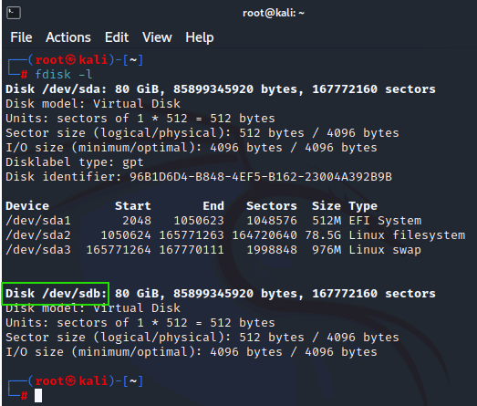

Enter the full disk path name of the storage device with a size of 80 GiB but no existing partition divisions in the text box below:

Enter fdisk /dev/sdb to initiate the tool to create storage partitions.
```bash
fdisk /dev/sdb
```
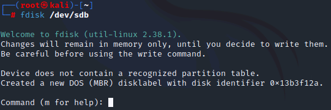


Enter m to display the full help menu of commands for the fdisk utility.
```bash
m
```

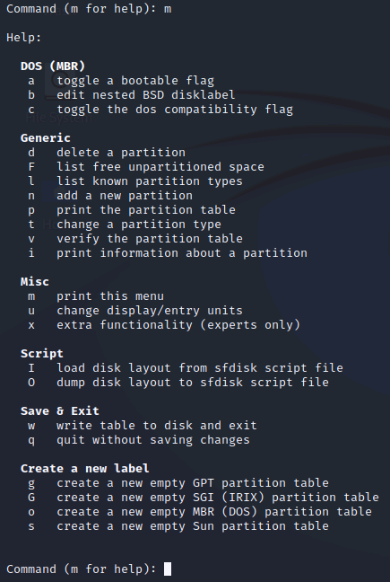

Enter p to print (i.e., display) the current partition table.

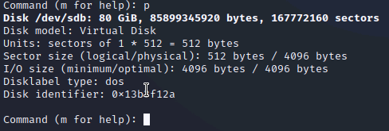

Notice there is no mention of a partition table in the results. This indicates that there are no partitions on this drive…yet. However, the lack of confirmation is unsettling.

Enter v to verify the partition table.

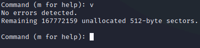

Notice the results indicate that there are no errors and that the same number of sectors listed by the p command is shown by the v command to be unallocated.

Enter n to create a new partition.

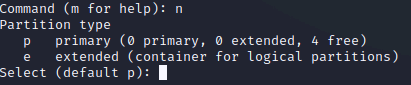

Enter p in response to the Partition type query.

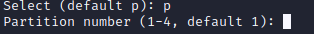

Enter 1 in response to the Partition number query.

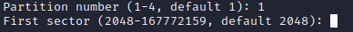

Press Enter in response to the First sector query to accept 2048 (the default).

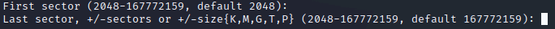

Press Enter in response to the Last sector query to accept 167772159 (the default (and the last sector)).

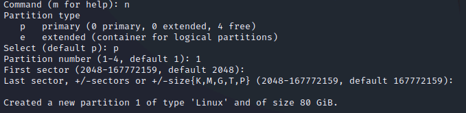

The result should be a confirmation that a new partition was created.

Enter p to print (i.e., display) the current partition table.

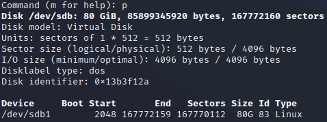

This output should now include the partition you just created.

Enter w to write the partition table changes to the storage device and exit fdisk.
```bash
w 
```

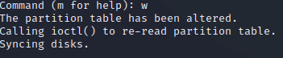

Enter mkfs -t fat /dev/sdb1 to format the new partition with the FAT32 file format.
```bash
mkfs -t fat /dev/sdb1
```

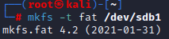

FAT32 is used in this exercise to simulate a USB drive that will be used to transfer files between various OSes.

Enter mkdir /mnt/SalesStorage to create a mounting point folder for the new storage device.
```bash
mkdir /mnt/SalesStorage
```

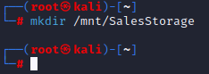

Enter mount /dev/sdb1 /mnt/SalesStorage to mount the newly formatted partition to the mount point location.
```bash
mount /dev/sdb1 /mnt/SalesStorage
```

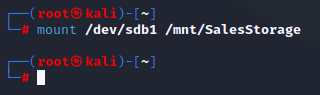

Enter ls -l /mnt/SalesStorage to view the empty mapped storage location.
```bash
ls -l /mnt/SalesStorage
```

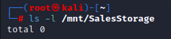

To copy some files to the new storage location, enter the following command:

```bash
cp -r /usr/share/seclists/* /mnt/SalesStorage/
```

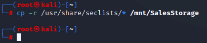

This should take less than 30 seconds to copy.

Enter ls -l /mnt/SalesStorage to view the contents copied to the new storage location.
```bash
ls -l /mnt/SalesStorage
```

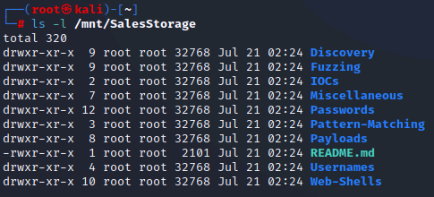

# 2. Deleting and Recovering Files

Delete and undelete a file objects
In this exercise, you will work through the process of deleting a directory and all of its contained files,
then attempt to restore or undelete those files.

Return to the Terminal window.

Enter rm -r /mnt/SalesStorage/Miscellaneous to delete this directory and its contents.
```bash
rm -r /mnt/SalesStorage/Miscellaneous
```

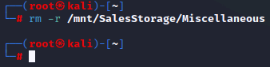

Enter ls -l /mnt/SalesStorage to view the contents of the storage location.
```bash
ls -l /mnt/SalesStorage
```

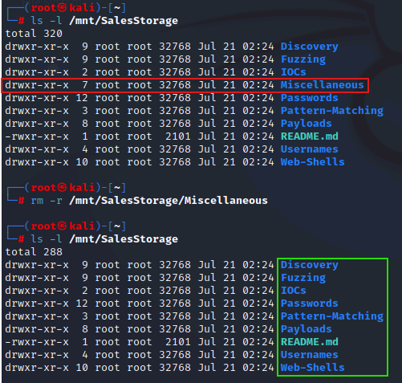

The Miscellaneous folder should no longer be present. By removing (i.e., deleting) files and folders from a Terminal window, the file objects are not captured in the Trash utility to be recovered easily.

Enter testdisk /dev/sdb1 to attempt to undelete the deleted files and folder.
```bash
testdisk /dev/sdb1
```

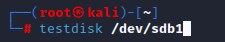

The TestDisk tool should open and present /dev/sdb1 for processing.
Notice that at the bottom of the interface, the [Proceed ] option is highlighted. Press Enter on your keyboard to select this option.

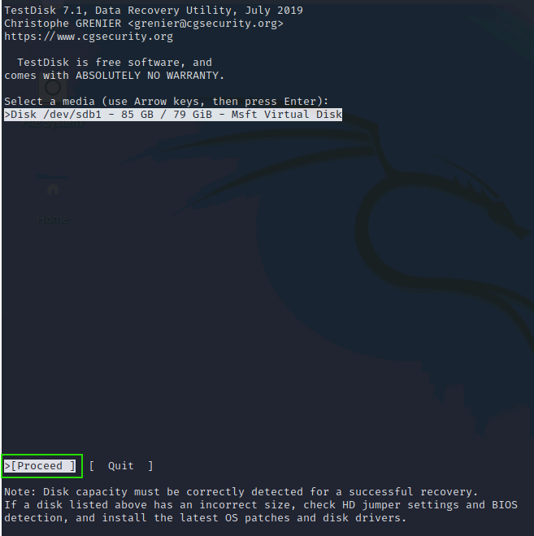

Use your keyboard's down arrow key to select [None ] as the partition table type, then press Enter on your keyboard.

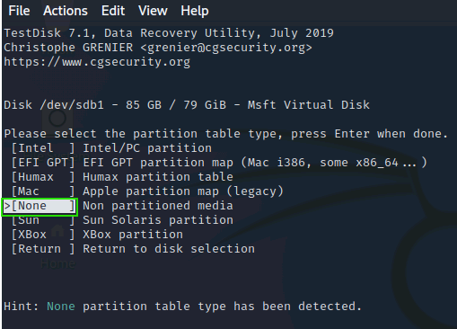

Since you are working against a partition, there are no further sub-partitions.

This will result in a display of a FAT32 partition, which will be highlighted. Use your keyboard's right arrow key to highlight [Undelete] at the bottom of the screen, then press Enter on your keyboard.

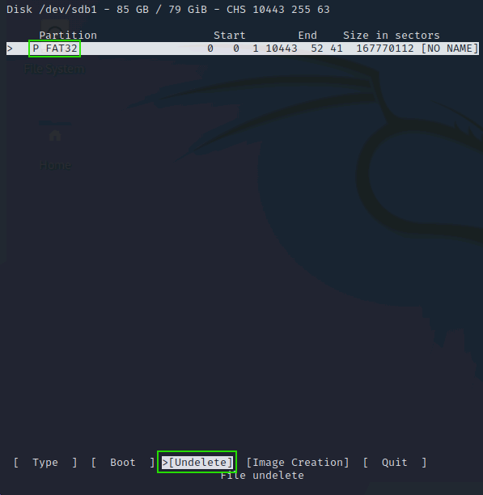

Use your keyboard's down arrow key to highlight Miscellaneous.

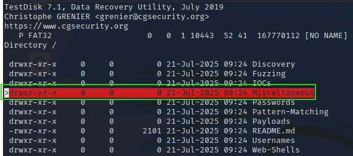

Type : to select the current highlighted file object.

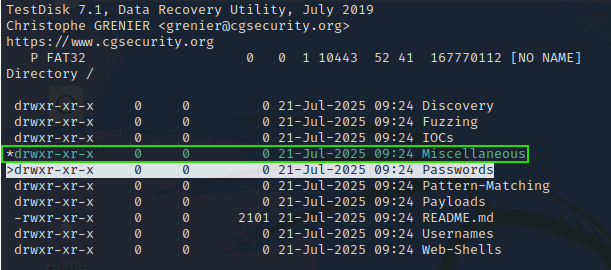

Type capital C to copy the selected file object(s).

A listing of the contents of the root account's home folder will be displayed. You need to select an output destination. 
Use your keyboard's down arrow key to highlight Downloads, press Enter to open the Downloads directory, then type a capital C on your keyboard to set the destination directory.

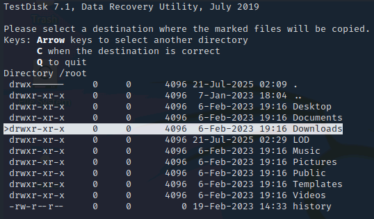

After a few moments, there should be a message of Copy done! above the file listing.

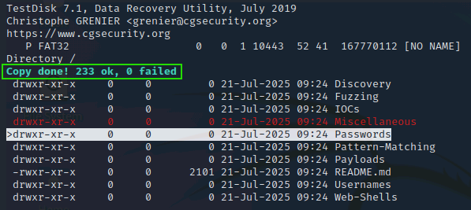

Press CTRL+C to exit testdisk and return to the Terminal window prompt.

Enter ls -l Downloads/Miscellaneous
```bash
ls -l Downloads/Miscellaneous
```

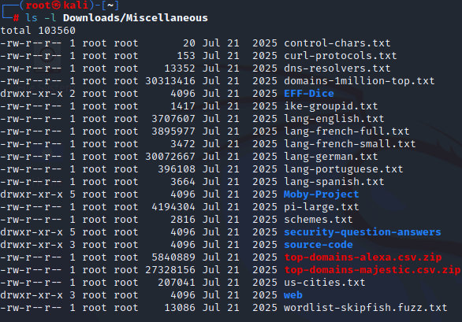

If the directory listing does not display properly, enter reset, then try the command again. 
Deletion and formatting are not specifically data destruction operations. A deletion marks a file's storage locations 
(typically clusters, a.k.a. allocation unit, storage allocation unit, or storage node, on an HDD or a block on an SSD) as available for re-use but does not actually remove the original data. 
Formatting does this across an entire partition. As long as the data clusters/blocks are not overwritten, the data is typically recoverable. 
To truly remove data, it needs to be overwritten by something else.


## 3. Secure File Deletion with Shred

Now that you know deleted files may be recoverable, you want to test whether a secure deletion will
prevent file recovery.

Return to the Terminal window.

Enter ls -l /mnt/SalesStorage to view the contents of the storage device.
```bash
ls -l /mnt/SalesStorage
```

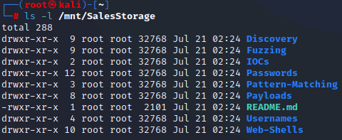

Enter ls -lR /mnt/SalesStorage/Passwords to view the recursive contents of the Passwords directory on the storage device.
```bash
ls -lR /mnt/SalesStorage/Passwords
```

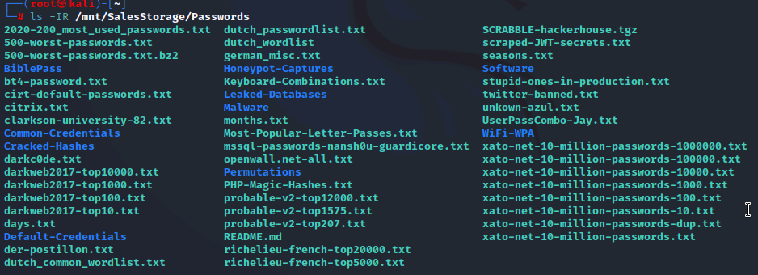

Enter cat /mnt/SalesStorage/Passwords/bt4-password.txt to view the contents of one of the files from within the Passwords directory. 
```bash
cat /mnt/SalesStorage/Passwords/bt4-password.txt
```

Use the following command to use find and shred to securely delete all files within the Passwords directory on the SalesStorage storage location using a zeroization process:

```bash
find /mnt/SalesStorage/Passwords -type f -exec shred -uvz {} \;
```

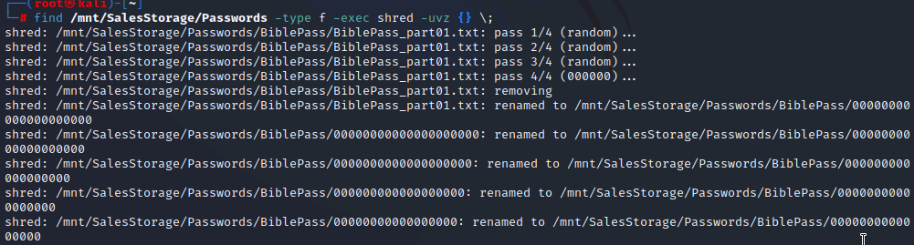

This secure deletion and zeroization process is a bit involved, so it will take up to a minute to complete. You will see the verbose progress output as the operations are performed. 
The shred utility only accepts individual files as targets. This command combines the find tool's function to locate and identify files as a means to send filenames as input to the shred utility.

Enter ls -lR /mnt/SalesStorage/Passwords to view the recursive contents of the Passwords directory on the storage device.
```bash
ls -lR /mnt/SalesStorage/Passwords
```

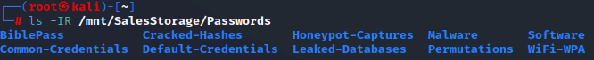

Notice the Passwords directory is still present, but all contained files within all sub-directories are no longer present.

Enter rm -r /mnt/SalesStorage/Passwords to delete the empty directories.
```bash
rm -r /mnt/SalesStorage/Passwords
```

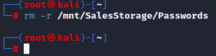

Enter testdisk /dev/sdb1 to attempt to undelete the deleted files and folder.
```bash
testdisk /dev/sdb1
```

The TestDisk tool should open and present /dev/sdb1 for processing.

Notice that at the bottom of the interface, the [Proceed ] option is highlighted. Press Enter on your keyboard to select this option.

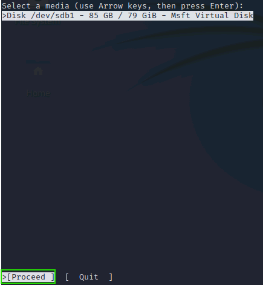

Use your keyboard's down arrow key to select [None ] as the partition table type, then press Enter on your keyboard.

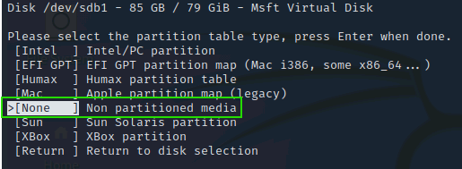

Since you are working against a partition, there are no further sub-partitions.

This will result in a display of a FAT32 partition, which will be highlighted. 
Use your keyboard's right arrow key to highlight [Undelete] at the bottom of the screen, then press Enter on your keyboard.

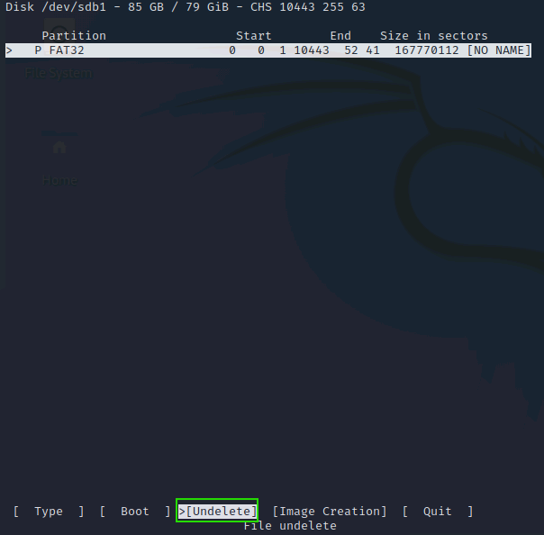

Use your keyboard's down arrow key to highlight Passwords, then press Enter.

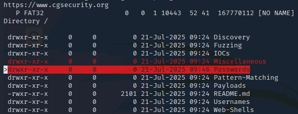

The contents of the directory structure still retain the filenames from the Passwords directory.

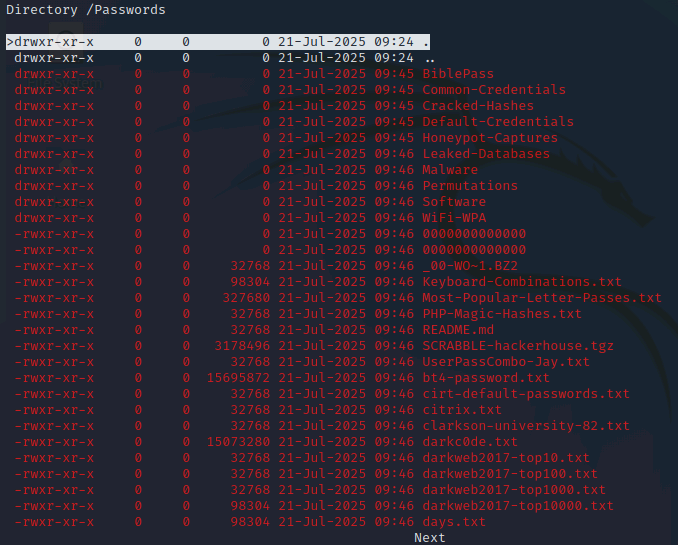

Press your keyboard's left arrow to return to the previous list of directories.

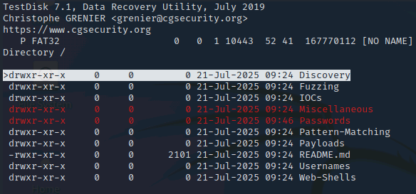

Use your keyboard's down arrow key to highlight Passwords.

Type : to select the current highlighted file object.

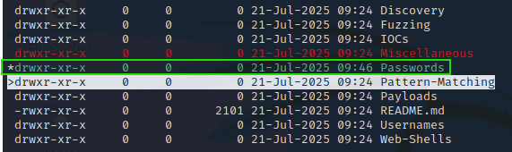

Type capital C to copy the selected file object(s).

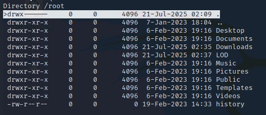

A listing of the contents of the root account's home folder will be displayed. You need to select an output destination. 
Use your keyboard's down arrow key to highlight Downloads, press Enter to open the Downloads directory, then type a capital C on your keyboard to set the destination directory.

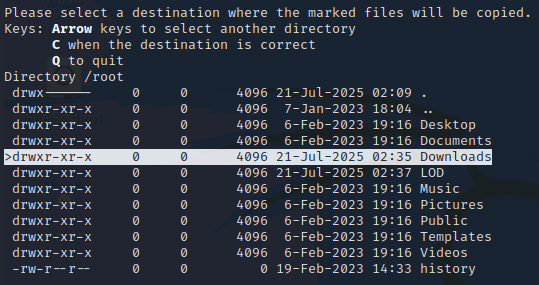

After a few moments, there should be a message of Copy done! above the file listing.

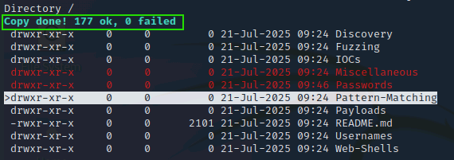

Press CTRL+C to exit testdisk and return to the Terminal window prompt. 

Enter ls -l Downloads/Passwords
```bash
ls -l Downloads/Passwords
```

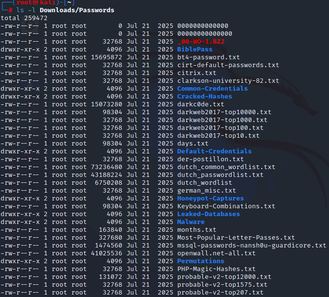

If the directory listing does not display properly, enter reset, then try the command again. Initially, it looks like all of the files were restored. However…

Enter cat Downloads/Passwords/bt4-password.txt.
```bash
cat Downloads/Passwords/bt4-password.txt.
```

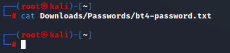

Notice the file has no contents. You can attempt to view the contents of any of the supposedly recovered files, but their contents have been shredded (i.e., zeroized).

This technique does protect the data, but the filenames, directory names, and file sizes are still retained. And it seems to only address data that is still retained in a standard file.

## 4. Formatting and Recovery Attempt

It has often been recommended to format a drive to destroy data. In this exercise, you will format a
drive and confirm that files are no longer present.

However, the native tools available on Kali are insufficient to retrieve data from a drive that has been
formatted. This exercise demonstrates that limitation, but with only a single tool. There may be
open-source and commercial tools that can recover data after a drive format.

Return to the Terminal window.

Enter umount /mnt/SalesStorage
```bash
umount /mnt/SalesStorage
```

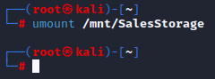

The command is umount NOT unmount.

Enter mkfs -t fat /dev/sdb1 to format the storage device to attempt to sanitize the data.
```bash
mkfs -t fat /dev/sdb1
```

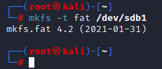

Enter testdisk /dev/sdb1 to attempt to undelete the deleted files and folder.
```bash
testdisk /dev/sdb1
```


The TestDisk tool should open and present /dev/sdb1 for processing.

Notice that at the bottom of the interface, the [Proceed ] option is highlighted. Press Enter on your keyboard to select this option.

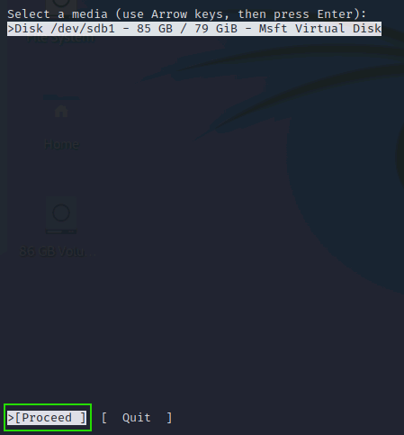

Use your keyboard's down arrow key to select [None ] as the partition table type, then press Enter on your keyboard.

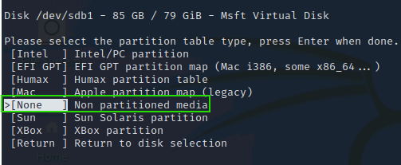

Since you are working against a partition, there are no further sub-partitions.

This will result in a display of a FAT32 partition, which will be highlighted. Use your keyboard's right arrow key to highlight [Undelete] at the bottom of the screen, then press Enter on your keyboard.


This should result in a display claiming No file found. Filesystem may be damaged.


This indicates that any remaining data is not recoverable using the testdisk utility. 

Press CTRL+C to exit testdisk and return to the Terminal window prompt.

There are some commercial drive recovery utilities and services which may be able to restore data after reformatting. Therefore, formatting is not considered a secure sanitization or data destruction technique. But, for low classification, sensitivity, or value data, it may be sufficient.

Leave the Terminal window open.

## 5. Full Disk Sanitization


Drive sanitization is the forceful overwriting of the entire drive with alternate data as a means to
destroy data and prevent data remnant recovery. In this exercise, you will use dd (i.e., disk duplicator)
to destroy all data on a storage device through overwriting.

Return to the Terminal window.

Since the data on the drive was formatted in the previous exercise, use the following commands to
place data on the drive again:

```bash
mount /dev/sdb1 /mnt/SalesStorage
```

```bash
cp -r /usr/share/seclists/* /mnt/SalesStorage/
```


Enter the following command to perform a zeroization sanitization of the storage device:   

> ⚠️ **Destructive:** Double‑check the target device (`/dev/sdb`) before running `dd`.
```bash
dd if=/dev/zero of=/dev/sdb bs=1M status=progress
```


This operation will take almost two minutes to complete. You will be able to view the progress as it operates. Remember, the target drive is 80 GiB in size.
An alternative is to use the command: dd if=/dev/random of=/dev/sdb bs=1M status=progress. However, the random overwriting progress takes more time.
```bash
dd if=/dev/random of=/dev/sdb bs=1M status=progress
```

Enter fdisk /dev/sdb to initiate the tool to manage storage partitions. 
```bash
fdisk /dev/sdb 
```
Enter p to print (i.e., display) the current partition table.


Notice there is no mention of a partition table in the results. This indicates that there are no partitions on this drive…anymore.

Enter v to verify the partition table.


Notice the results indicate that there are no errors and that the same number of sectors listed by the p command is shown by the v command to be unallocated.

Enter q to exit fdisk.
```bash
q
```


Enter testdisk /dev/sdb to attempt to access the storage device itself.
```bash
testdisk /dev/sdb
```

The TestDisk tool should open and present /dev/sdb for processing.

Notice that at the bottom of the interface, the [Proceed ] option is highlighted. Press Enter on your keyboard to select this option.


Use your keyboard's down arrow key to select [Intel ] as the partition table type, then press Enter on your keyboard.


Use your keyboard's down arrow key to select [ Analyse ], then press Enter on your keyboard.


The result should indicate that there are no partitions on this storage device.


Press CTRL+C to exit testdisk and return to the Terminal window prompt.
