# 03 – Using Storage Encryption

This document captures the complete procedure and screenshots for configuring, testing, and recovering Windows EFS (Encrypting File System). It’s written in a brand‑neutral style and preserves the full procedural detail from the source project.

### Objectives
- Configure an **EFS Data Recovery Agent (DRA)**.
- Encrypt files (GUI + `cipher`) and verify status. 
- Break a user’s EFS access by changing the password.
- Recover encrypted data using the DRA and validate access.

### Tools & Techniques
MMC (Local Security Policy / Group Policy Object Editor), File Explorer, **EFS**(Encrypting File System), `cipher`, `net user`, Certificate Import Wizard

### Sample Outputs
cipher /r:EFSRA        -> EFSRA.cer / EFSRA.pfx created
cipher                 -> E (encrypted) / U (unencrypted)
cipher /d Jan-Security.txt -> 1 file(s) were decrypted
cipher /c Jan-Security.txt -> Recovery certificate: Admin (DRA)

### Key Takeaways
- Define and **back up** a DRA before users encrypt data.
- Password resets can invalidate a user’s EFS private key (data remains safe).
- The DRA restores **data access**, not the user’s original private key.

## Table of Contents
- [1) Configure an EFS Data Recovery Agent (DRA)](#1-configure-an-efs-data-recovery-agent-dra)
- [2) Encrypt files with EFS (as Pat)](#2-encrypt-files-with-efs-as-pat)
- [3) Break Pat’s EFS access via password change (as Admin)](#3-break-pats-efs-access-via-password-change-as-admin)
- [4) Use a Data Recovery Agent (DRA) to recover access to EFS encrypted files (as Admin)](#4-use-a-data-recovery-agent-dra-to-recover-access-to-efs-encrypted-files-as-admin)

---

# Using Storage Encryption

### Objectives
- Configure an EFS **Data Recovery Agent (DRA)**.  
- Encrypt files with EFS (GUI + `cipher`) and verify status.  
- Break a user’s EFS access via password change and confirm loss of access.  
- Recover encrypted data using the DRA and validate the result.

### Tools & Techniques
MMC (Local Security Policy / Group Policy Object Editor), File Explorer, **EFS**, `cipher`, `net user` (Windows Server).

### Sample Outputs
```text
cipher /r:EFSRA        -> EFSRA.cer / EFSRA.pfx created
cipher                 -> E (encrypted) / U (unencrypted)
cipher /d Jan-Security.txt -> 1 file(s) were decrypted
cipher /c Jan-Security.txt -> Recovery certificate: Admin (DRA)
```

### Key Takeaways
- Define and **back up** a DRA before users start encrypting.  
- Admin password resets can invalidate a user’s EFS private key (data remains safe).  
- The DRA restores **data access**, not the user’s original private key.

---

## 1) Configure an EFS Data Recovery Agent (DRA)

About EFS (Encrypting File System)

Storage encryption can live at different layers—full-disk, partition, volume, file, database, even individual records. In this project we focus on file-level encryption using EFS, a feature of NTFS on Windows. EFS encrypts each file with a one-time file encryption key (FEK) (symmetric), then protects that FEK by encrypting it with the user’s EFS certificate (asymmetric). A designated Data Recovery Agent (DRA) can also hold a protected copy so authorized recovery is possible.

Important—set a DRA first:
Always configure and back up a DRA before encrypting anything with EFS. If a user’s password is reset or their EFS private key is lost/corrupted, files can become unreadable without a DRA.

Sign in to the workstation

Connect to PC10, press Ctrl+Alt+Delete, and sign in as Jaime or whatever user you might've created in your simulation.
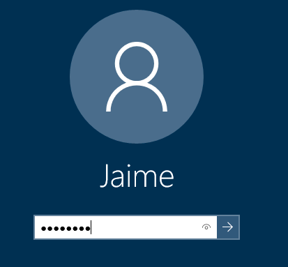

We start as Jaime because it’s the domain administrator and the default account on PC10. After we remove PC10 from the domain later, we’ll switch to the local administrator account named Admin.

Select Type here to search from the taskbar, type powershell, then right-click Windows PowerShell from the results, then select Run as administrator.  
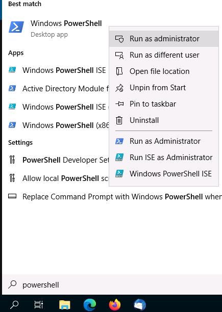

Approve the UAC prompt (Yes) 

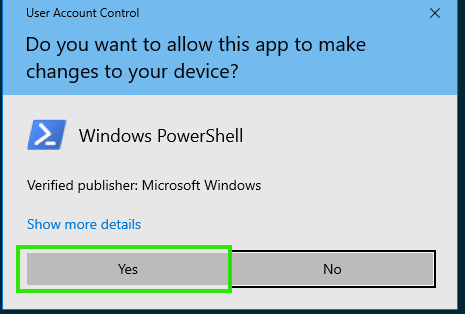

Enter the following code into the Administrator: Windows PowerShell console:
Change to the folder  
```cmd
Remove-Computer -UnjoinDomaincredential Administrator -Restart –Force
```
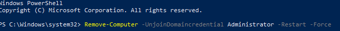

This operation removes the PC10 virtual machine from the domain and configures it as a stand-alone system. This is necessary for this lab in order to simulate the loss of an EFS private key. The process used in this lab to remove a user's EFS private key does not work on a domain member.

On the Windows PowerShell credential request window, type Password as the password, then select OK
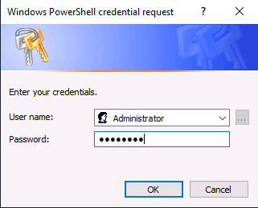

After a few seconds, the system will reboot. 

Connect to the PC10 virtual machine, send Ctrl+Alt+Delete and sign in as Admin with the password.
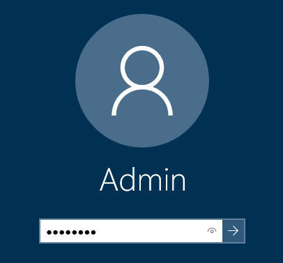

Since the system is no longer a member of the domain, you must use local accounts. The local administrator account is named admin. 

Manually create an Encryption File System (EFS) Data Recovery Agent (DRA) certificate stored in a new folder named c:\certificates.

Select Type here to search from the taskbar, type cmd, right-click Command Prompt from the results, then select Run as administrator.
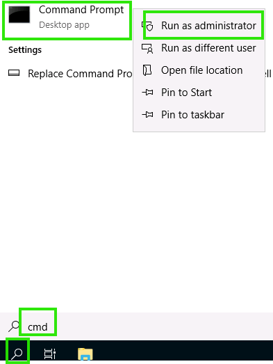

Select Yes in the User Account Control window.

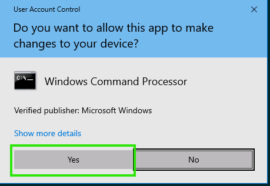

To create a folder, run the command:
```cmd
mkdir c:\certificates
```
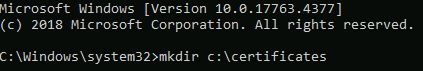

To change to the new folder, run the command:
```cmd
cd c:\certificates
```


To create and export a certificate to be used for EFS recovery agent activities, run the command:
```cmd
cipher /r:EFSRA
```
At the prompt to provide a password to protect the .PFX file, enter Password.

Confirm the password Password.

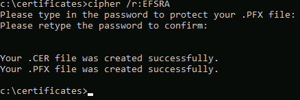

To view the new certificate files enter the command:
```cmd
dir
```
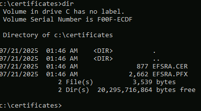

Leave the Command Prompt window open.

You will not see any characters echoed in the Command Prompt window for the password. After you type the password, press enter.

This operation creates and saves the EFS DRA certificate as a file named EFSRA.CER and a separate file named EFSRA.PFX which contains the password-protected private key for the EFS DRA certificate.

The original name for the Data Recovery Agent (DRA) was Key Recovery Agent (KRA). However, some misunderstood the concept of the KRA, assuming it would restore access to the lost EFS private key, which the KRA (nor the DRA) is unable to accomplish. The new DRA name clearly indicates this account is only able to restore access to the data.

Add the EFS DRA certificate to the Local Security Policy

Select Type here to search from the taskbar, type mmc.exe, then select mmc.exe Run command from the results.
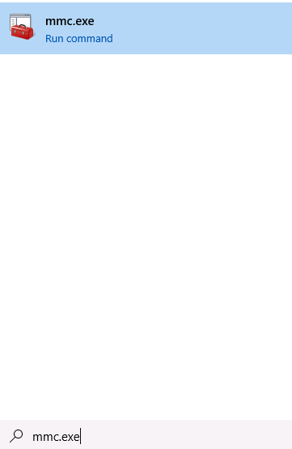

Select Yes in the User Account Control window.

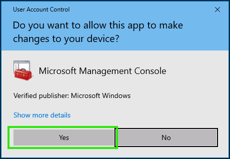

From the Console1 window, select File, then select Add/Remove Snap-in….

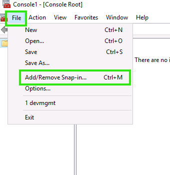

On the Add or Remove Snap-ins window, select Group Policy Object Editor, then select Add >.
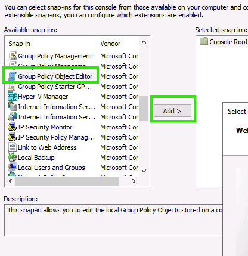

On the Select Group Policy Object window, leave the default name of "Local Computer", and select Finish. 
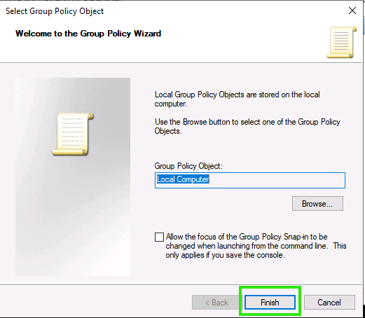

Select OK to close the Add or Remove Snap-ins window.

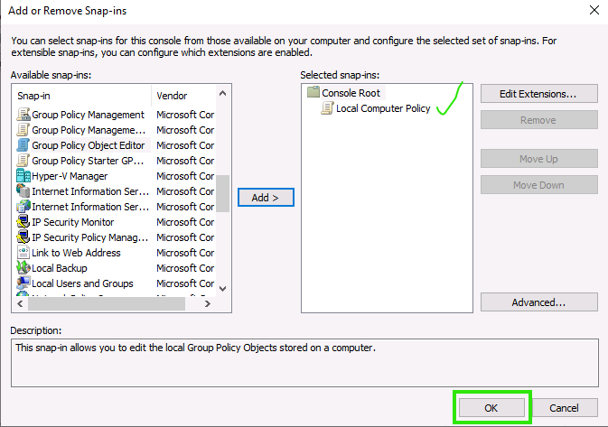

The Local Computer Policy should now be displayed in the Console1 window. Select Local Computer Policy in the left pane.
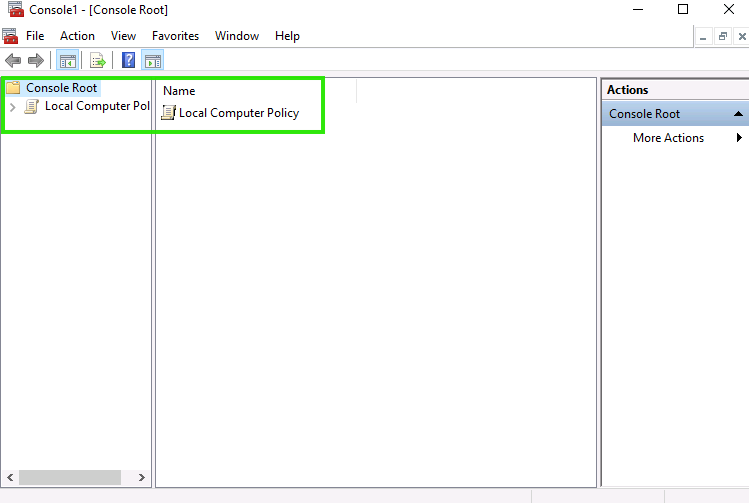

In the left pane, under Computer Configuration, double-click to expand Windows Settings | Security Settings | Public Key Policies, then select Encrypting File System.

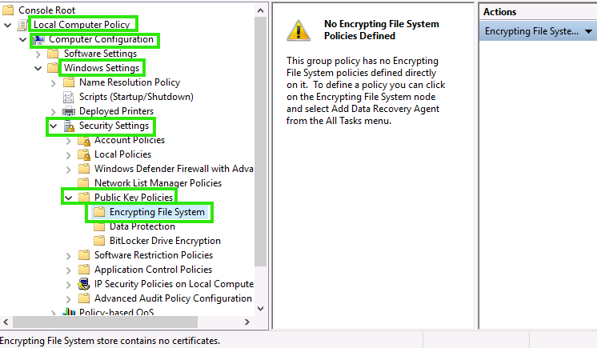

You may need to click-hold-drag-release the pane divisions to resize them.

Right-click Encrypting File System in the left pane, and then select Add Data Recovery Agent….

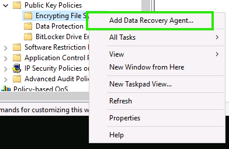

On the Add Recovery Agent Wizard, select Next.

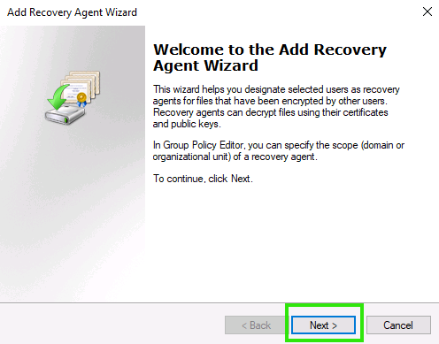

On the Select Recovery Agent page, select Browse Folders.

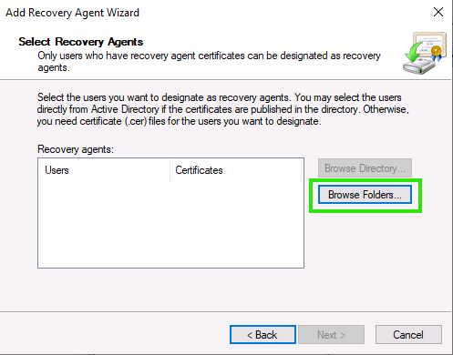

Select the arrow to expand This PC, then select Local Disk (C:), double-click the certificates folder, select the EFSRA file, then select Open. This imports the public key file named EFSRA.CER

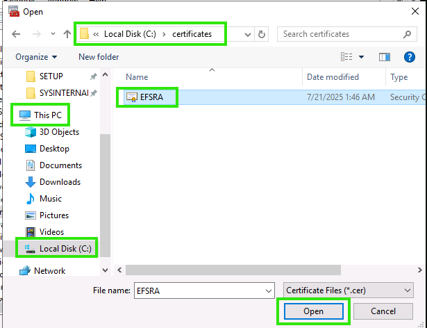

On the Add Recovery Agent window, select Yes.

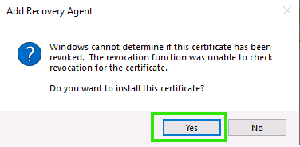

On the Add Recovery Agent Wizard window, select Next, then select Finish.

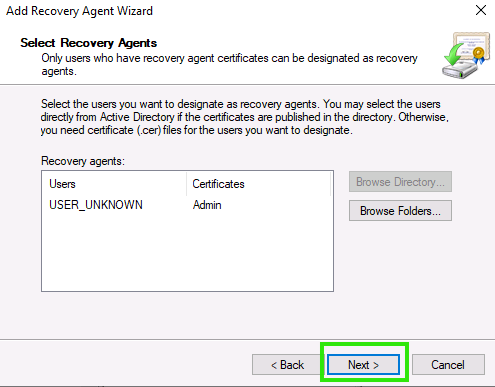

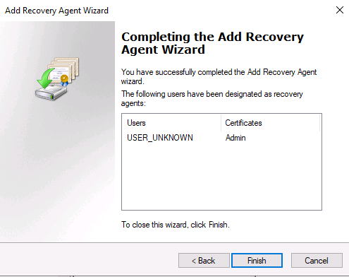

You should see the Admin certificate listed in the right pane.

Close the Console1 window. Select No when prompted to save settings.

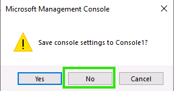

Stand-alone Non-Domain joined Windows systems do not have a pre-defined Data Recovery Agent (DRA). A domain-member Windows system may or may not have a DRA defined. The DRA can recover EFS encrypted files in the event the original owner and encryptor of the files loses access or is removed from the computer or organization. In order for this recovery process to function, a DRA must be defined prior to the encryption of files.

Create a new local user account named Pat with password of Password1.
Return to the Administrator: Command Prompt.
Create the new account by entering the following:
Create user **Pat**  
```cmd
net user Pat Password1 /add
```  
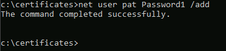

You are assigning a unique password to the pat account.

---

## 2) Encrypt files with EFS (as Pat)

EFS is a native feature of NTFS. EFS allows for individual files (or entire folders) to be encrypted without needing to encrypt an entire storage device or volume. EFS is easy to use, both from a GUI utility as well as from the CLI.

Sign out of PC10 by selecting the Start menu, then selecting Admin (which will be a circle at the top of the menu), then select Sign out. 
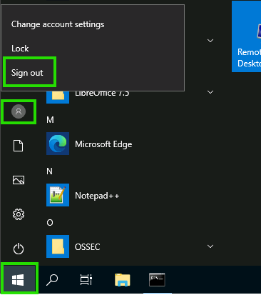

If prompted that there are open programs, select Sign out anyway.

Connect to the PC10 virtual machine, send Ctrl+Alt+Delete and then sign in as Pat with the password Password1. 
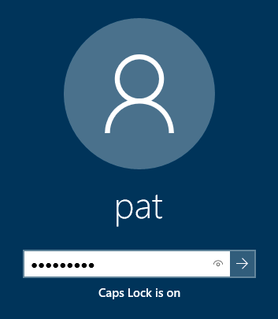

It may take a minute for the user profile to be created.

Create a text file named **Jan-Security.txt** in a new folder named C:\SecReports.

Select Type here to search from the taskbar, type File Explorer into the Windows search bar, and then, on the menu, select File Explorer.

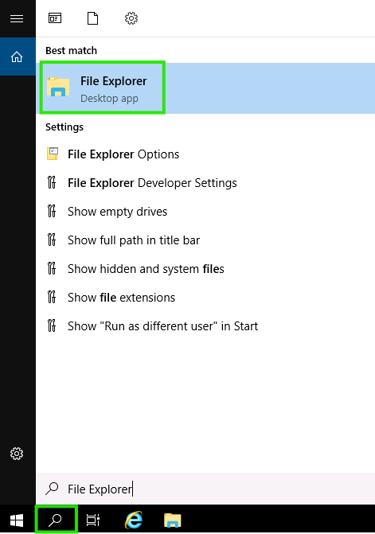

Select This PC, then double-click Local Disk (C:).

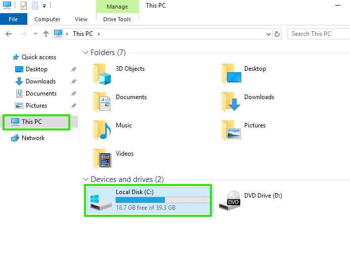

In the blank space of the folder view pane (i.e., the right pane), right-click, select New, then select Folder.

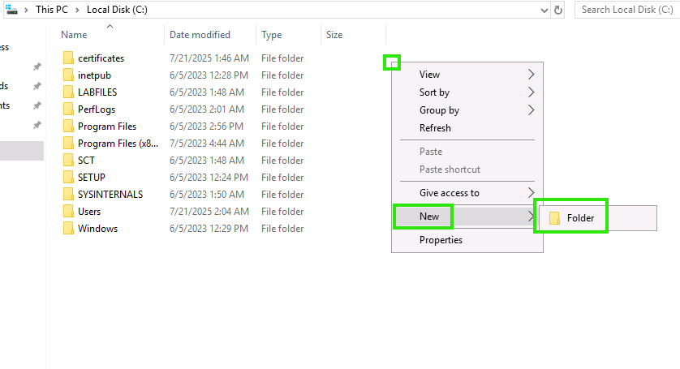

Enter SecReports for the folder name.

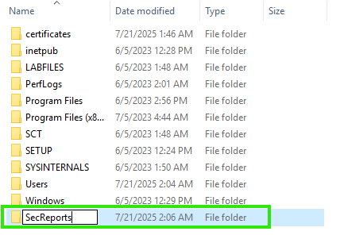

Double-click SecReports to open the folder.

Right-click in the empty folder area, select New, then select Text Document.

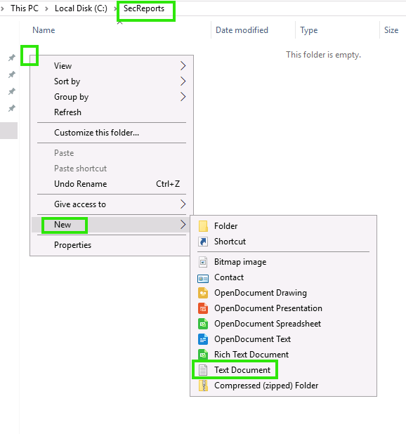

Enter the name Jan-Security.


File Explorer does not display known file extensions by default. So, while you only provided the main filename of Jan-Security, the actual filename with the extension is **Jan-Security.txt**.

Create two additional text files named Feb-Security and Mar-Security in the folder named C:\SecReports.

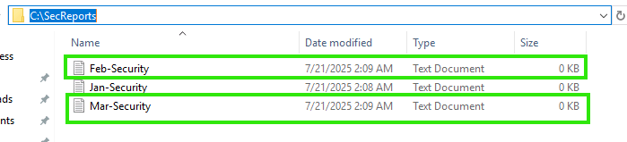

Open each of these new text files and enter This a security report. and save each file.

Double-click Jan-Security.
In the Notepad window, enter This a security report..
Close Notepad.
Select Save to save the changes.

Repeat these steps for Feb-Security and Mar-Security.

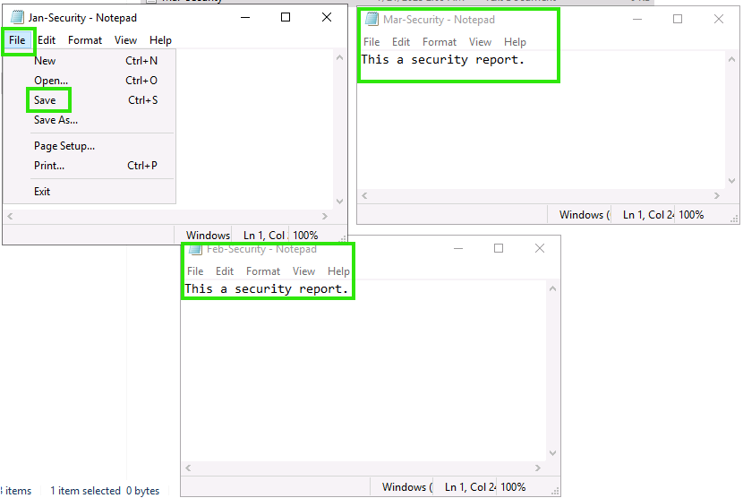

Using File Explorer, encrypt Jan-Security with the Encryption File System (EFS).

Right-click the text file **Jan-Security.txt** in the C:\SecReports folder then select Properties.

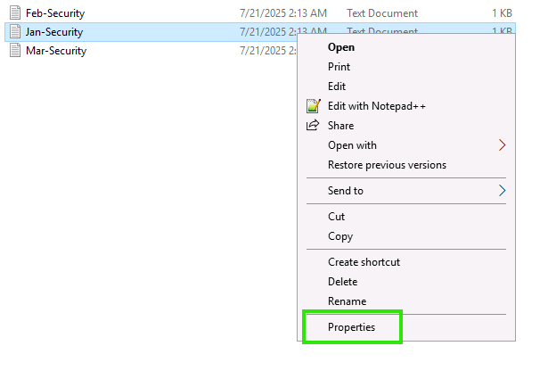

On the General tab, select Advanced.

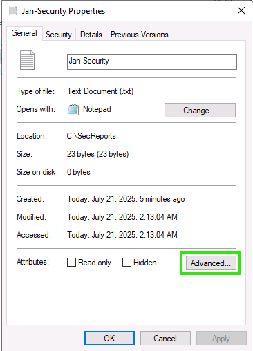

Select the checkbox named Encrypt contents to secure data.

Select OK to close the Advanced Attributes window.

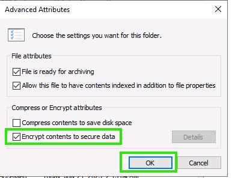

Select OK to close the **Jan-Security.txt** Properties window.

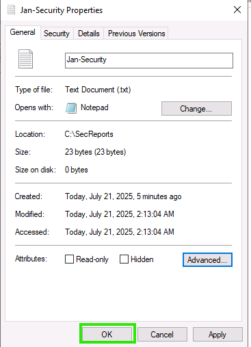

An Encryption Warning window will appear, select Encrypt the file only, do not mark the checkbox, and then select OK.

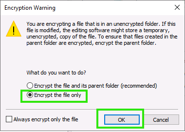

The Encryption File System (EFS) is configured by default to encrypt folders and the contents of those folders. When being used to encrypt individual files, you will be prompted to confirm or elect to encrypt the entire folder to which the current file is a member.
You will receive a message about backing up your EFS key. You can ignore the message for this exercise. It will disappear after a few seconds or when you select anything else on the desktop. However, it is a good idea to back up your EFS keys. Because if they are lost or corrupted, you will be unable to access your encrypted files ever again (unless you have a DRA defined who can restore your files to you.

It may take 10 to 15 seconds for EFS to encrypt the file. This is only because this is the first time EFS is being used on this drive, and system configurations must take place. Subsequent encryptions will take less time.

Check the status of the files in C:\SecReports using the cipher command and then encrypt **Feb-Security.txt** and **Mar-Security.txt** using the CLI.
Select Type here to search from the taskbar, type cmd, then select Command Prompt from the results.

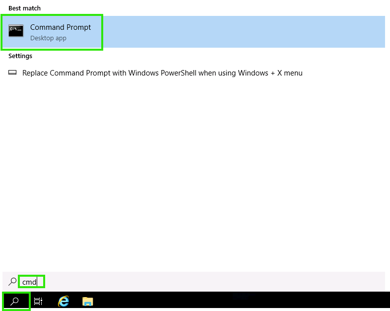

To change to the C:\SecReports folder, run the command:
```cmd
cd c:\SecReports
```
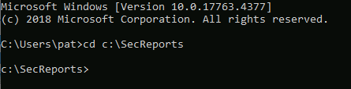

To view the encryption status of the objects in the current working folder, run the command:
```cmd
cipher
```

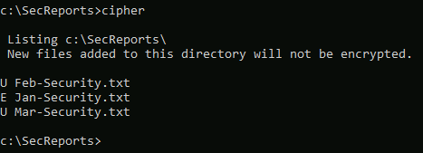

The cipher command without parameters will display the contents of the current working directory along with an indication of the encryption status of each item. The "E" indicates the item is encrypted, while the "U" indicates the item is unencrypted.

To encrypt several files at once from the Command Prompt (instead of the GUI), run the command:
```cmd
cipher /e *-Security.txt
```

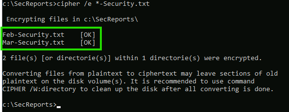

This command and parameters encrypts all files matching the *-Security wildcard in the current directory, which includes **Feb-Security.txt** and **Mar-Security.txt**.

Check the status of the files in C:\SecReports using the cipher command and then decrypt **Mar-Security.txt** using the CLI. Then view the status of the files again to confirm the result.
To view the encryption status of the objects in the current working folder, run the command:
```cmd
cipher
```
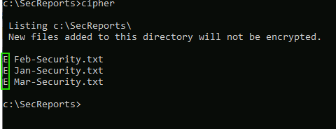

Notice all 3 text files are now marked as encrypted.

To decrypt a file, run the command:
```cmd
cipher /d Mar-Security.txt
```
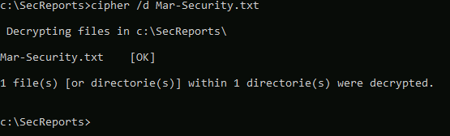

This command and parameters decrypts the **Mar-Security.txt** file.

To view the encryption status of the objects in the current working folder, run the command:
```cmd
Cipher
```
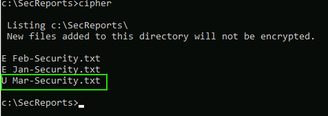

Notice that **Jan-Security.txt** and **Feb-Security.txt** text files are now marked as encrypted (i.e., E), and **Mar-Security.txt** text file is marked as unencrypted (i.e., U).

Close the Command Prompt.

Configure File Explorer to display encrypted files in alternate colors.

File Explorer should be open.

From the File Explorer menu, select View, then select Options.

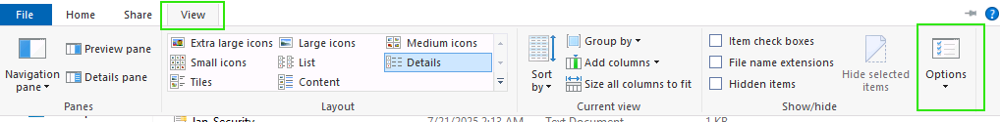

Select View tab.

Scroll to locate and then select Show encrypted or compressed NTFS files in color.


Select OK to close the Folder Options window.


Notice that the encrypted files in c:\SecReports are now color-coded to indicate if they are encrypted (green) or unencrypted (black).

Sign-out Pat from PC10


On the PC10 virtual machine, send Ctrl+Alt+Delete and sign in as Admin with the password Password.


Open File Explorer and view the contents of the c:\SecReports folder.


Notice that **Jan-Security.txt** and **Feb-Security.txt** files have a locked yellow padlock icon over their file icon. This indicates this is an encrypted file.

Attempt to open **Jan-Security.txt** by double-clicking is filename. A notepad warning is displayed, indicating you do not have permission to open this file. Select OK to close the warning. Then close Notepad.


If a How do you want to open this file? window appears, select Notepad, mark the checkbox Always use this app to open .txt files, then select OK.

Attempt to open **Feb-Security.txt** by double-clicking is filename. A notepad warning is displayed, indicating you do not have permission to open this file. Select OK to close the warning. Then close Notepad.


Attempt to open **Mar-Security.txt** by double-clicking is filename. You are able to open the file as it is not encrypted, and the default inherited permissions granted the Admin user at least read access. Close Notepad.


EFS can be used as a means by which individual users can limit access to files and folders without the need to configure access control settings on those files and folders. Any user that does not possess the correct EFS key will be unable to access the EFS encrypted files. While EFS does hide the context of files from other non-authorized users, it does not hide the existence of or the name of the file.

---

## 3) Break Pat’s EFS access via password change (as Admin)

When an administrator changes the password of a local user account, the EFS private key of that user account is discarded. Therefore, an administrator cannot use a password change as a means to access the encrypted files of a user. However, this does mean the user loses their ability to access the EFS encrypted files as well.

Connect to the PC10 virtual machine, and if needed, send Ctrl+Alt+Delete, and then sign in as Admin with the password Password.

Change the password of Pat to Password123 using the Command Prompt.

Select Type here to search from the taskbar, type cmd, right-click Command Prompt from the results, then select Run as administrator.


Select Yes in the User Account Control window.


To change the password of the Pat run the command:
```cmd
net user Pat Password123
```


There will be no confirmation.

You are logged out of the Pat account on PC10 which ensures that the password change will also replace the EFS key assigned to the account.

Sign out Admin from PC10.


On the PC10 virtual machine, send Ctrl+Alt+Delete, and sign in as Pat with the password Password1.


Notice the error message stating that the password is incorrect.

Select OK, then sign in to the Pat account using the new password of Password123..


Open File Explorer and view the contents of the C:\SecReports folder.


Attempt to open Jan-Security by double-clicking its filename. A notepad warning is displayed, indicating you do not have permission to open this file. Select OK to close the warning. Then close Notepad.


Attempt to open Feb-Security by double-clicking on Feb-Security. A notepad warning is displayed, indicating you do not have permission to open this file. Select OK to close the warning. Then close Notepad.


Attempt to open Mar-Security by double-clicking on Mar-Security. You are able to open the file as it is not encrypted and, therefore, not affected by the account's loss of its EFS key. Close Notepad.


Why is the Pat account no longer able to open their encrypted files? because An administrator forcibly changed their password.

Sign out Pat from PC10.
 


---

## 4) Use a Data Recovery Agent (DRA) to recover access to EFS encrypted files (as Admin)

If a user has lost access to their EFS private key, they are no longer able to open their encrypted files. If there was a defined DRA when the files were encrypted, the DRA may be able to restore access to the files to the user.

On the PC10 virtual machine, send Ctrl+Alt+Delete, and sign in as Admin using Pa$$w0rd as the password.


Attempt to decrypt **Jan-Security.txt** using the cipher command. Then use the cipher command to display information about the encrypted file.

Select Type here to search from the taskbar, type cmd, right-click Command Prompt from the results, then select Run as administrator.


Select Yes in the User Account Control window.


To change to the C:\SecReports folder, run the command:
```cmd
cd c:\\SecReports
```


Attempt to decrypt **Jan-Security.txt** by running the command:
```cmd
cipher /d Jan-Security.txt
```


Notice the results are that an error occurred, and no files were decrypted.

Run the command:
```cmd
cipher /c Jan-Security.txt
```


Review the information about the file.

Notice the display indicates that Admin is the designated Recovery Certification entity. However, the reason the attempt to decrypt the file failed is that the private key of the ECA DRA has not been imported. Thus, without that private key, the DRA function cannot take place.

Install the EFSRA.PFX private key.

The default configuration of Windows hides file extensions. Double-clicking EFSRA.CER will open a Certificate window displaying the details of the certificate rather than the expected Certificate Import Wizard. If this occurs, close the Certificate window and double-click the other file (which, therefore, would be EFSRA.PFX).

Open File Explorer.

Select This PC, then double-click Local Disk (C:), and double-click the certificates folder.


Double-click the EFSRA file, which is labeled as being of Type Personal Information Exchange (note: this label may be truncated to "Personal Informati…") and which has an icon of a document extending out of an envelope with a yellow key overlaid. This opens the Certificate Import Wizard.

Leave the default selection of Current User, and select Next.


Leave the default file name of C:\certificates\EFSRA.PFX, and select Next.


Enter Password in the Password: field, leave all other settings at their defaults, then select Next.


Leave the default selection of Automatically select the certificate store based on the type of certificate, select Next, then select Finish.


On the Certificate Import Wizard notification that The import was successful, select OK.


Return to the Command Prompt, and attempt to decrypt **Jan-Security.txt** using the cipher command.


Notice this time the operation is successful and will display a message stating: "1 file(s) [or directorie(s)] within 1 directorie(s) were decrypted."

Use the cipher command to view the encryption status of the current folder's files.


Notice that **Jan-Security.txt** is now listed as unencrypted (i.e., marked with a "U"). This means as a DRA, you have recovered access to an encrypted file after the original user lost their decryption capabilities. Remember that it was originally encrypted by Pat, but you are currently logged in as Admin. But as the EFS DRA with your private key installed, you are able to decrypt files from other users.

View the details about encryption of the **Feb-Security.txt** file through File Explorer, then use the GUI method to decrypt the file.

Return to File Explorer. If it is not open, select Type here to search from the taskbar, type File Explorer into the Windows search bar, and then, on the menu, select File Explorer.

Select This PC, then double-click Local Disk (C:).

Double-click SecReports to open the folder.

Right-click **Feb-Security.txt** and select Properties.


Select Advanced, then select Details.


The User Access to **Feb-Security** window displays the users who have access to the file, in this case, only Pat, as well as the Recovery certificates, in this case, that of Admin. Select OK to close this window.


De-select the checkbox named Encrypt contents to secure data and then select OK, then select OK again.


You may be prompted by an Access Denied window, select Continue.


This Access Denied window is an element of User Account Control (UAC). Even though you are logged in with administrative privileges, the system is configured by default to display the UAC warning. By selecting Continue, you are verifying that you understand the activity being attempted will be using administrative privileges.

The File Explorer window focused on C:\SecReports should show that **Feb-Security.txt** is no longer encrypted.

Sign out Admin from PC10.

On the PC10 virtual machine, send Ctrl+Alt+Delete, and sign in as Pat with the password Password123.

Open File Explorer and view the C:\SecReports folder.

Notice all files in this folder are no longer encrypted.


Open and view the contents of each text file, closing Notepad after.


This confirms that the EFS DRA was able to recover the data files on behalf of the user that lost access to their own EFS private key due to an admin changing their password. 

An Encryption File System (EFS) Data Recovery Agent (DRA) is able to decrypt files in order to return them to an accessible state. This capability is useful in situations where the user's EFS private key is damaged, lost, or discarded (such as when an administrator changes their password). 

The ability of an EFS DRA to decrypt files can also be useful in recovering files encrypted by a user account that has been deleted or by a user who refuses to cooperate with management or investigators.
